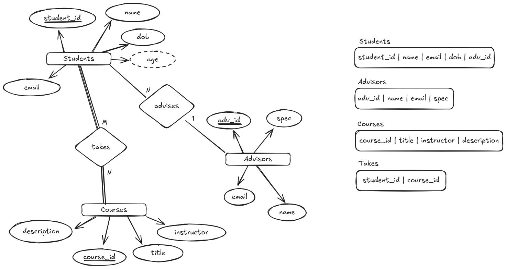

```sql
CREATE TABLE students(
    student_id INT PRIMARY KEY AUTO_INCREMENT,
    name VARCHAR(100) NOT NULL,
    email VARCHAR(150) NOT NULL UNIQUE,
    dob DATE NOT NULL,
    advisor_id INT NOT NULL,
    CONSTRAINT fk_students_advisor FOREIGN KEY (advisor_id) 
        REFERENCES advisors(advisor_id) 
	    ON DELETE SET NULL 
        ON UPDATE CASCADE
);

CREATE TABLE advisors(
    advisor_id INT PRIMARY KEY AUTO_INCREMENT,
    name VARCHAR(100) NOT NULL,
    email VARCHAR(150) NOT NULL UNIQUE,
    specialization VARCHAR(50)
);

CREATE TABLE courses(
    course_id VARCHAR(10) PRIMARY KEY,
    title VARCHAR(100) NOT NULL,
    instructor VARCHAR(100) NOT NULL,
    description VARCHAR(200)
);

CREATE TABLE enrollment(
    student_id INT,
    course_id INT,
    enrollment_date DATE NOT NULL DEFAULT CURRENT_DATE,
    PRIMARY KEY(student_id,course_id),
    CONSTRAINT fk_enrollment_student FOREIGN KEY(student_id) 
        REFERENCES students(student_id)
	    ON DELETE CASCADE
        ON UPDATE CASCADE,
    CONSTRAINT fk_enrollment_course FOREIGN KEY(course_id) 
        REFERENCES courses(course_id) 
	    ON DELETE CASCADE
        ON UPDATE CASCADE
);
```
